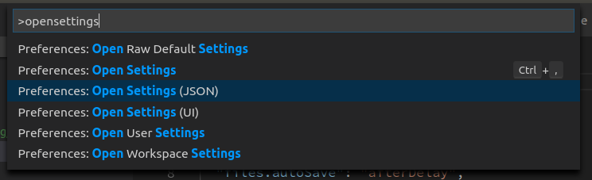

- Download VSCode

- Edit your vscode `settings.json`:

 **paste the following snippet in there:**
```json
{
	"editor.renderWhitespace": "none",
	"editor.renderIndentGuides": true,
	"files.autoSave": "afterDelay",
	"editor.minimap.enabled": false,
	"workbench.activityBar.visible": false,
	"workbench.statusBar.visible": false,
	"window.menuBarVisibility": "toggle",
	"prettier.semi": false,
	"editor.tabSize": 2,
	"prettier.eslintIntegration": true,
	"prettier.singleQuote": true,
	"eslint.validate": [
		"javascript",
		"javascriptreact",
		{"language": "vue", "autoFix": true},
		// {"language": "html", "autoFix": true}
	],
	"eslint.autoFixOnSave": true
}
```

:+1: Awesome